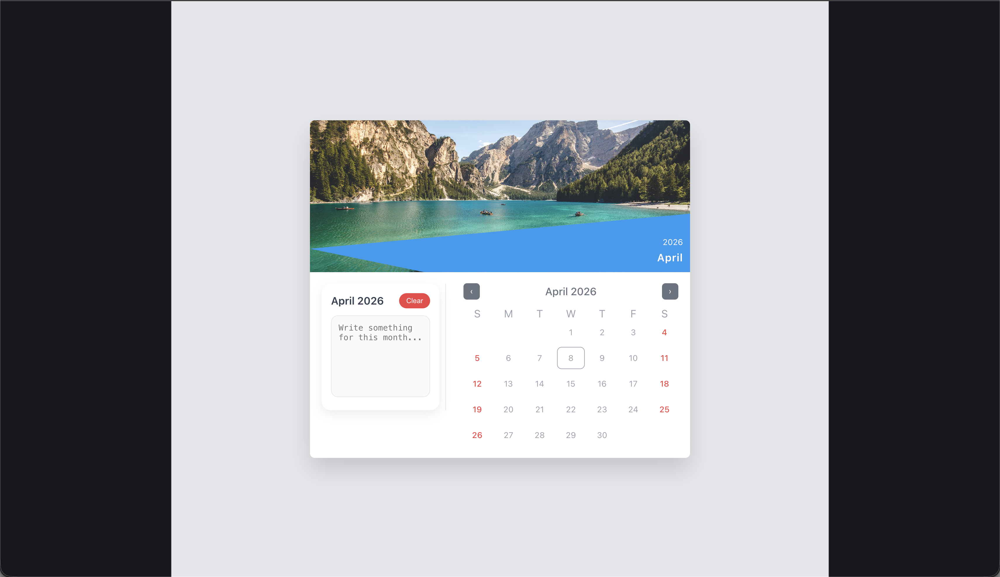

# 📅 Calendar Notes App

A modern and interactive calendar application with **date range selection** and **monthly notes support**, designed with a clean and responsive UI.

---

## 🚀 Features

* 📆 Interactive calendar with month navigation
* 🎯 Date range selection (start → end)
* 📝 Monthly notes (auto-saved using localStorage)
* 🎨 Weekend highlighting (Saturday & Sunday)
* 🌟 Today indicator
* 🧩 Modular component-based architecture
* ⚡ Smooth and responsive UI

---

## 🖼️ Preview



---

## 🛠️ Tech Stack

* **Frontend:** React + TypeScript
* **Styling:** Tailwind CSS + Custom CSS
* **State Management:** React Hooks
* **Storage:** LocalStorage

---

## 📂 Project Structure

```
src/
│
├── components/
│   ├── calendar/
│   │   ├── Calendar.tsx
│   │   ├── CalendarGrid.tsx
│   │   ├── CalendarHeader.tsx
│   │   ├── DayCell.tsx
│   │
│   ├── notes/
│   │   ├── NotesPanel.tsx
│   │
│   ├── layout/
│       ├── WallLayout.tsx
│
├── hooks/
│   ├── useDateRange.ts
│
├── utils/
│   ├── dateUtils.ts
│
├── styles/
│   ├── calendar.css
│   ├── notes.css
│   ├── wall.css
```

---

## ⚙️ Installation & Setup

### 1️⃣ Clone the repository

```
git clone https://github.com/your-username/your-repo.git
cd your-repo
```

### 2️⃣ Install dependencies

```
npm install
```

### 3️⃣ Run the app

```
npm run dev
```

---

## 🧠 Key Concepts Used

* Lifting state up (WallLayout as single source of truth)
* Custom hooks (`useDateRange`)
* Controlled components (Notes textarea)
* Dynamic rendering of calendar grid
* LocalStorage persistence

---

## 👨‍💻 Author

**Tirthankar Ghosh**

---

⭐ If you like this project, don't forget to give it a star!